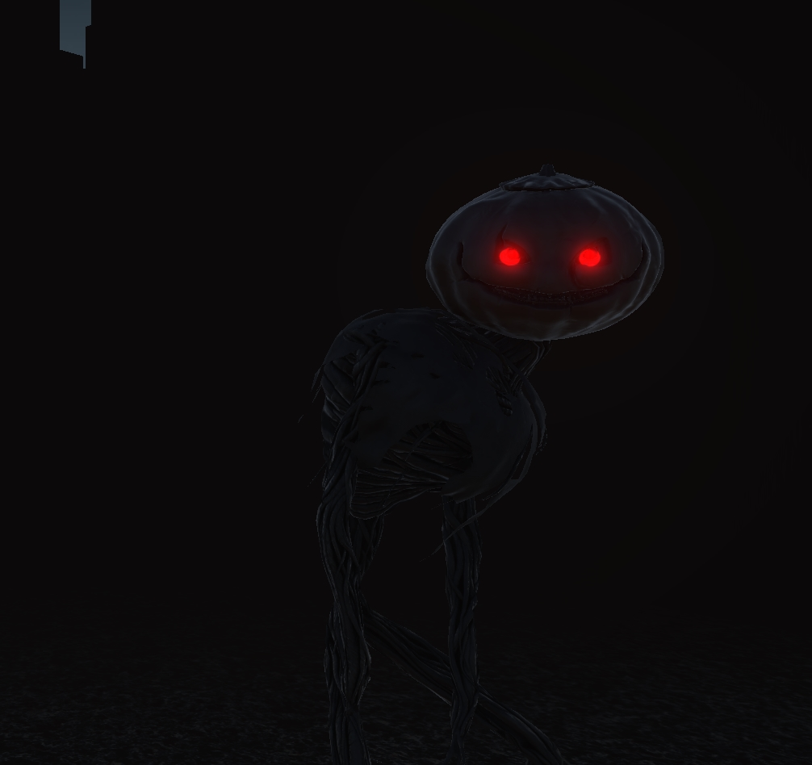
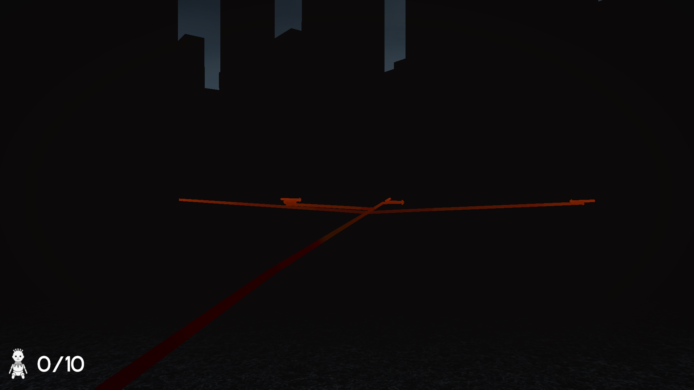

Disponível para download em: [https://arthur-020104.itch.io/projetoaiaestrela](https://arthur-020104.itch.io/projetoaiaestrela)

---

### Gameplay

#### Objetivo

Este jogo foi desenvolvido como um trabalho para a disciplina de Inteligência Artificial da Universidade Federal de Uberlândia (UFU). O objetivo principal do jogador é explorar o mapa gerado proceduralmente para encontrar e coletar todas as **N** bonecas, que são necessárias para ativar o portal de fuga. Uma vez que todas as bonecas forem coletadas, o som do portal guiará você para a segurança.

#### Controles

* **Movimento:** W, A, S, D
* **Correr:** Shift Esquerdo
* **Interagir/Coletar Itens:** E
* **Habilidade Especial (Localizador de Bonecas):** F
* **Olhar:** Mouse

#### Mecânicas Principais

* **Visão Limitada:** Uma névoa persistente restringe severamente sua visibilidade, forçando você a navegar com cuidado e a confiar em outros sentidos.
* **Audição:** O som é um elemento crucial. Preste atenção aos passos do inimigo para determinar sua proximidade e direção. O jogo utiliza um sistema de som dinâmico, onde uma música de suspense aumenta de intensidade e volume à medida que o perigo se aproxima.
* **Habilidade Especial - O Localizador:** Pressionar a tecla 'F' ativa uma habilidade especial que revela um rastro visual temporário em direção a todas as bonecas restantes.
* **Risco e Recompensa:** Usar esta habilidade tem um custo significativo. O barulho gerado para localizar as bonecas também alerta o monstro sobre a sua posição, fazendo com que ele se mova em sua direção. Use com extrema cautela.

### Características Técnicas

* **Pathfinding com A\*:** O núcleo da inteligência artificial do inimigo e da mecânica de localização de itens é o algoritmo A\*.
    * **IA Inimiga:** O monstro utiliza o A\* para navegar de forma eficiente pelo mapa e para perseguir o jogador, uma vez que sua localização é conhecida.
    * **Localizador de Bonecas:** A habilidade especial do jogador também emprega o A\* para calcular e exibir o caminho mais curto até cada boneca, criando os rastros visuais.
    
* **Geração Procedural de Mapas:** Cada partida acontece em um mapa único, gerado proceduralmente no início do jogo. Isso garante que não haja duas experiências de jogo iguais e aumenta a rejogabilidade.
* **Sistema de Som Dinâmico:** O áudio do jogo se adapta à situação. A proximidade do inimigo aciona uma trilha sonora de suspense que se intensifica, servindo como um aviso auditivo vital para o jogador.
* **Otimização de Mapa:** O mapa gerado é otimizado para combinar paredes adjacentes em malhas (meshes) maiores, melhorando o desempenho.

### Como Jogar

1.  Inicie o jogo.
2.  Preste atenção às instruções iniciais que detalham os controles e objetivos.
3.  Explore o ambiente escuro, usando o som a seu favor.
4.  Encontre e colete o número necessário de bonecas.
5.  Use a habilidade de localização (tecla F) com sabedoria, lembrando-se do risco de atrair o inimigo.
6.  Após coletar todas as bonecas, siga o som do portal para escapar e vencer o jogo.
7.  Se for pego pelo monstro, o jogo termina.